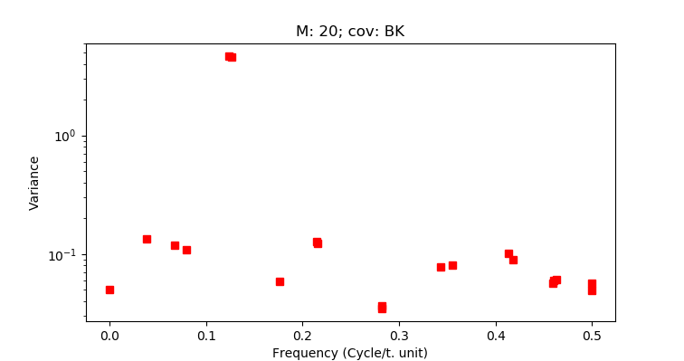
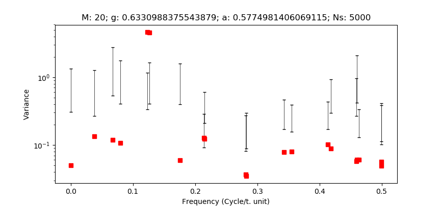
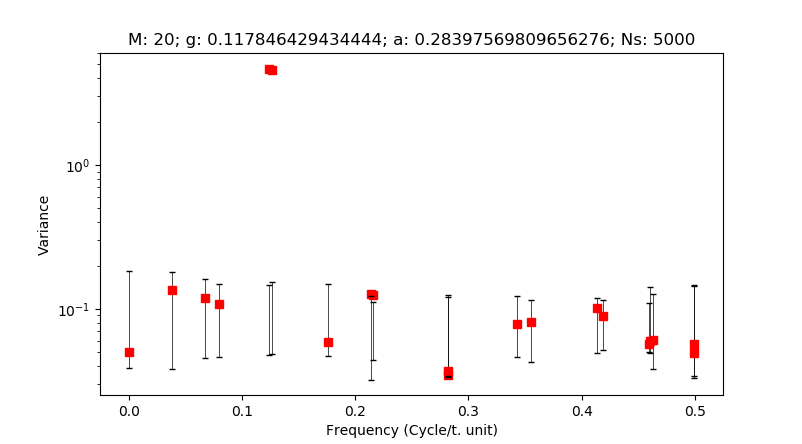

# mcssa

Python module to compute univariate Monte Carlo Singular Spectrum Analysis on python3

Methodology based on

Allen, Myles R., and Leonard A. Smith. "Monte Carlo SSA: Detecting Irregular
Oscillations in the Presence of Colored Noise."
Journal of Climate 9, no. 12 (1996): 3373-404.
http://www.jstor.org/stable/26201460.

## Usage

Clone repo on your machine and `cd` into the parent folder.
You can then locally install the package with:

`pip install -e mcssa`


## Requirements

Python3 with basic libraries (numpy, scipy, pandas and matplotlib)

## Example

_The steps of the following example can be found in the  __main__ of `mcssa.py`_

Take an example time series containing an oscillatory component and some
random noise

```Python3
import numpy as np
import matplotlib.pyplot as plt
from mcssa.mcssa import SSA,MCSSA

T = 8
series = [np.sin(2 * np.pi / T * i) + np.random.rand() for i in range(100)]
```
Perform a Singular Spectrum Analysis of the series with a window length of M=20

```Python3
ssa = SSA(series)
ssa.run_ssa(20)
ssa.plot(freq_rank=True)
```

The resulting plot gives an estimate of the spectrum of the series:



One can see a pair of EOFs with very high variance in the 0.125 cycles per time unit (cpu)
range, corresponding to a 8 time unit period. The precise value of the dominant frequencies can be obtained
with ```ssa.show_f()```. The reconstruction of the time series
corresponding to these EOFs can be obtained with:

```python3
RC=ssa.reconstruct([1,2])
RC.plot()
```

Now assume that the time series at study was given to us and that we have no a priori
knowledge on it. We would like to know if the spectral peak at 0.125 cpu is containing signal
or could have just been generated by random coloured noise.

In that aim we perform a Monte Carlo SSA, to determine the extent to which an AR(1) process
could have obtained similar variance on the data's EOFs. We use the same window lenght M=20 and
set the simulation to 5000 realisations.


```Python3
mcssa = MCSSA(series)
mcssa.run_mcssa(20, n_suro=5000)
mcssa.plot()
```
In the resulting spectrum the two supspected EOFs appear far above the 95% error bars,
indicating that the power they contain in the data series is statistically significant.
The precise significance can be obtained with ```mcssa.scores```.



Once the presence of signal in these two EOFs has been proven, they can be set aside
in a second test to check for other potential significant EOFs:

```Python3
mcssa.run_mcssa(20, n_suro=5000,filtered_components=[1,2])
mcssa.plot()
```



No further signal is detected as the remaining EOFs' variances lie within the error bars. 
